# Diablo 4 Trading -  Testing Documentation

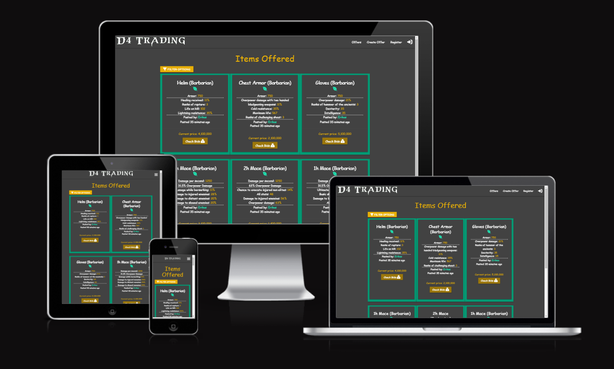

Visit the deployed site: [View the live project here](https://milestone-project-3-89cfc062fae7.herokuapp.com/)

- - -

## CONTENTS

- [Diablo 4 Trading -  Testing Documentation](#Diablo 4 Trading----testing-documentation)
  - [CONTENTS](#contents)
  - [Testing](#testing)
  - [AUTOMATED TESTING](#automated-testing)
    - [Validation Results](#validation-results)
    - [Lighthouse Test Results](#lighthouse-test-results)
  - [MANUAL TESTING](#manual-testing)
    - [Full Testing by developer](#full-testing-by-developer)
    - [Website interaction testing](#website-interaction-testing)
  - [3rd party testing during development](#3rd-party-testing-during-development)
  - [3rd party Blind Testing](#3rd-party-blind-testing)

## Testing

Testing was carried out at every point in the development to check for issues with the code, responsiveness, design, interactivity and accessibility. The developer tools used primarily were Chrome DevTools, with the console and terminal playing a key factor in testing and debugging.

Each page has been inspected using google chrome developer tools and lighthouse Firefox inspector tool to ensure that each page is fully responsive on a variety of different screen sizes and devices. I also physicaly tested the webiste on the Iphone 12, Ipad air, Macbook and Pc computers.

## AUTOMATED TESTING

### Validation Results

* The W3C Markup Validator and the W3C CSS Validator were used to test and validate every all three pages of
the Diablo 4 Trading interactive project to ensure that there were no syntax errors in the code. Chrome's
Lighthouse DevTool was also used to test for Performance, Accessibility, Best Practices and SEO.
JSHint was used to test JavaScript code quality.

* The main info on html Validator thowing info messages on *Trailing slash on void elements* due to /> close tag being added automaticaly by *prettier* and manualy removing it will be added next time the file is saved.

### Lighthouse Test Results

- Mobile - offer page
* 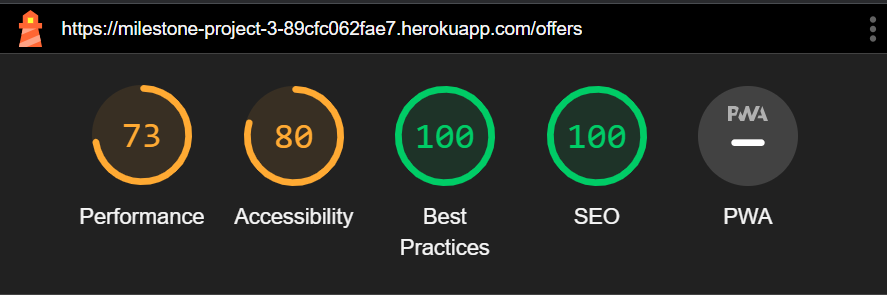
* Mobile - create offer page
* 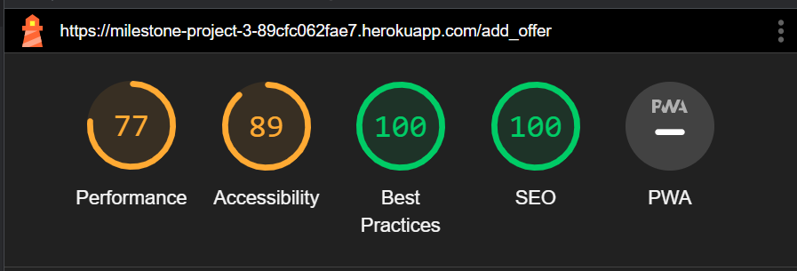
* Mobile - profile page
* 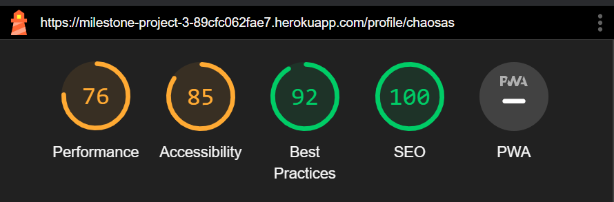  
* Mobile - profile_edit page
* 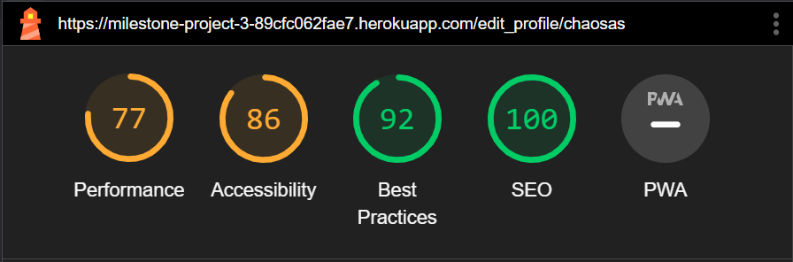  
* Mobile - messages page
* 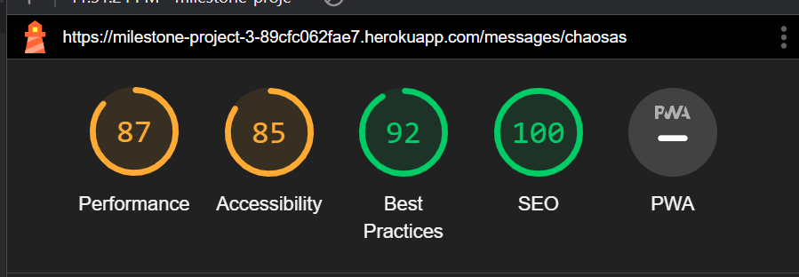
* Mobile - message page
* 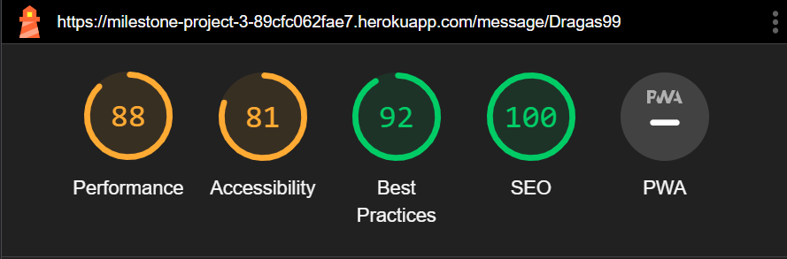
* Mobile - offer info page
* 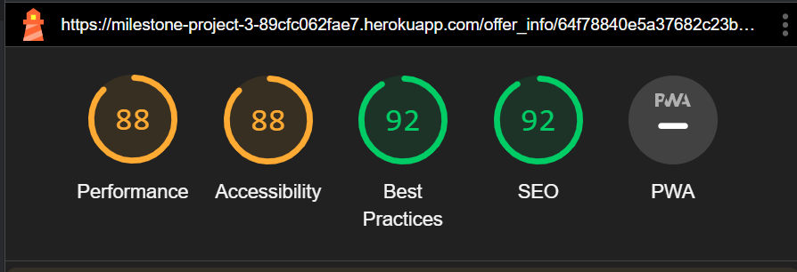  
  
* Desktop - offer page
* 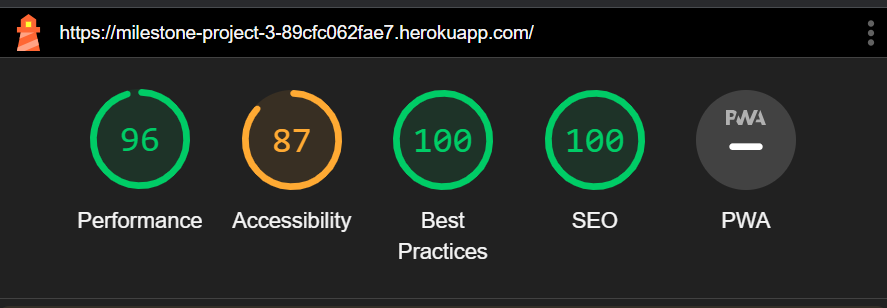
* Desktop - create offer page
* 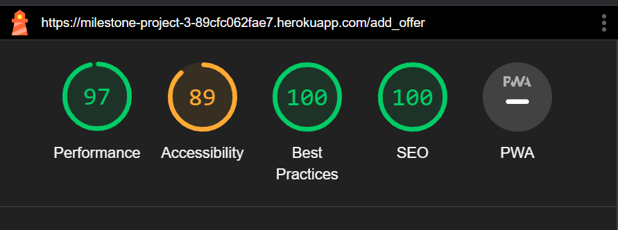
* Desktop - profile page
* 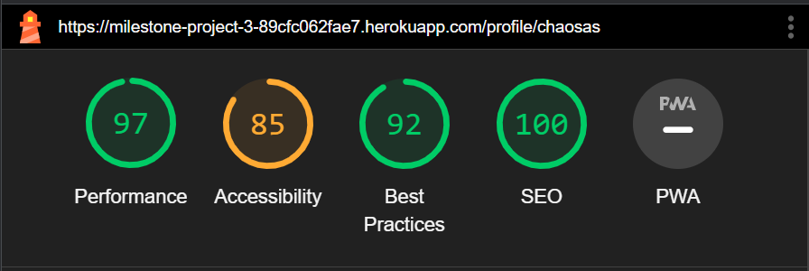  
* Desktop - profile_edit page
* 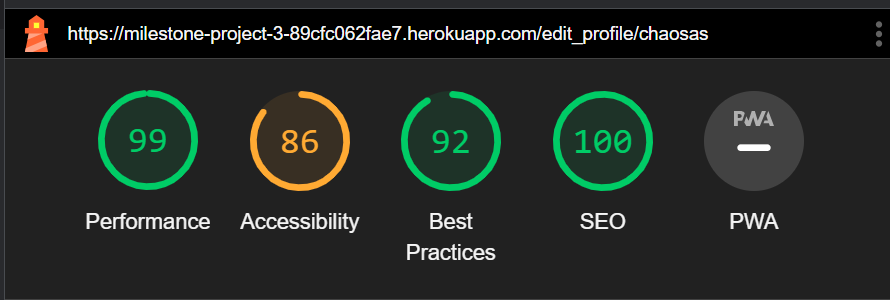 
*  Desktop - messages page
* 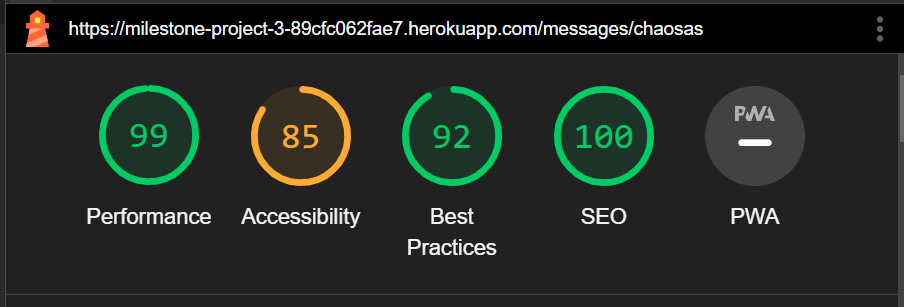
* Desktop - message page
* 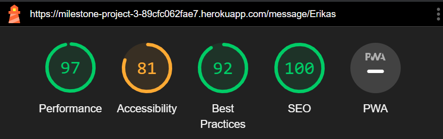
* Desktop - offer info page
* 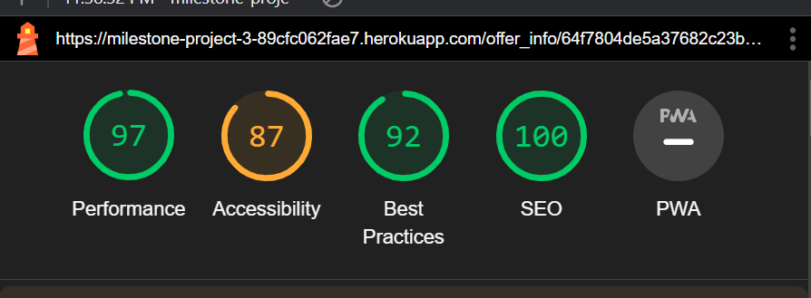  

## MANUAL TESTING

### Full Testing by developer

Full testing was performed on the following devices:

* Laptop:
  * Windows 11 2021 15 inch screen
    * Google Chrome
    * Safari
    * Firefox
    * Opera
    * OperaGX
  
* Mobile Devices:
  * iPhone 12 pro.
  * iPhone 14 pro.
    * Safari

### Website interaction testing

| # | Feature | Expected Outcome | Testing Performed | Pass/Fail |
| :---: | :--- | :---: | :---: | :---: |
| | Not loged in navigation | | | |
| --- | --- | --- | --- | --- |
| 1 | Navigation- Logo | Redirected to Offers page | Click Logo | ✅ |
| 2 | Navigation- Offers link | Redirected to Offers page | Click offers button | ✅ |
| 3 | Navigation- Create offer link | Redirected to Log in page | Click Create offer button | ✅ |
| 4 | Navigation- Register link | Redirected to Register page | Click Register button | ✅ |
| 5 | Navigation- Log In link logo | Redirected to log In page page | Click Log In logo | ✅ |
| 6 | Individual offer - creator Nickname | Redirected to log In page page | Click Individual offer creator Nickname | ✅ |
| 7 | Individual offer - Check Bids | Redirected to offer info page | Click Check Bids | ✅ |
| 8 | Offer info page- profile links for other users | Redirected to log In page page | Click profile links for other users | ✅ |
| 9 | Create new bid | Redirected to log In page page | Click ""bid"" button | ✅ |
| -- | --- | --- | --- | --- |
| | Loged in navigation | | | |
| --- | --- | --- | --- | --- |
| 10 | Navigation- Logo | Redirected to Offers page | Click Logo | ✅ |
| 11 | Navigation- Offers link | Redirected to Offers page | Click offers button | ✅ |
| 12 | Navigation- Create offer link | Redirected to Create offer page | Click Create offer button | ✅ |
| 13 | Navigation- profile link | Redirected to personal profile page | Click profile button | ✅ |
| 14 | Navigation- log out link logo | Redirected log out of sesion user | Click log out logo | ✅ |
| 15 | Navigation message count indetification | number 1- n depending on messages recieved | Send message to a user from another acount | ✅ |
| 16 | Navigation message count indetification taken out | number 1- n lowers down when messages deleted all the way to o (0 is not displayed) | Read messages that are undread yet | ✅ |
| -- | --- | --- | --- | --- |
| | Loged in Offer page | | | |
| --- | --- | --- | --- | --- |
| 17 | Individual offer - creator Nickname | Redirected to that users profile | Click Individual offer creator Nickname | ✅ |
| 18 | Individual offer - Check Bids | Redirected to offer info page | Click Check Bids | ✅ |
| -- | --- | --- | --- | --- |
| | Filter functionality | | | |
| --- | --- | --- | --- | --- |
| 19 | Different classes items to be displayed after filtering | Different class items displayed | repeted several times with different class but same other combinations | ✅ |
| 20 | Different items to be displayed after filtering | Different items displayed | repeted several times with different item but same other combinations | ✅ |
| 21 | Different items modes filtering | Different items displayed | repeted several times with different game modes but same other combinations | ✅ |
| 22 | Affixes scale 1-4 filtering alowing to look for 1-4 matching affixes out of even large lists | Different items displayed | repeted several times with different scale of affixes | ✅ |
| 23 | Affixes list to be looking from 1-n items but matching up to 4 affix | Different items displayed | repeted several times with different list of affixes | ✅ |
| 24 | Affixes scale to be higher (Example 4) thank list (example 2) | Different items displayed | Bug encountered and fixed. tested with several variations | ✅ |
| 25 | Reset button clears filtering | All items displayed | pressed reset button after filtering | ✅ |
| -- | --- | --- | --- | --- |
| | Create offer functionality | | | |
| --- | --- | --- | --- | --- |
| 26 | Creating items with different class | New offer created with selected class | Created item with each class | ✅ |
| 27 | Creating different types of items | New offer created with selected item pype | Created item with multiple item types | ✅ |
| 28 | Selecting item automaticaly generates suffixes and affixes for user | New suffix and affix apears | Selected multiple different item to see result | ✅ |
| 29 | Changing item will generate new affixes but will keep the maching and selected | New affixes apreas, maching ones remains, and selected maching stays | Selected multiple diferent items to see changes, as well as selecting some affixes to test | ✅ |
| 30 | Selecting affixes generates range bar acording to affix range | affix range apearing at the bottom of creation table | Different affixes selected | ✅ |
| 31 | Maximum 4 affixes selected, 5th one will blink warnign colour, and provide warning | Normal selected will have teal color, 5th will blink purple for short time. and materialise toest will apear. | slected multiple affixes though out testing | ✅ |
| 32 | Exacly 4 affixes required to condirm item creation | Add item button unavalable if <4 affixes selected | selected 1-4 affixes | ✅ |
| 33 | Suffix generated acording to item, some have none, some have 1 and some have more to be selected 1 out of n | Diferent suffixes generated upon changing item type |
selected different items | ✅ |
| 34 | Depending on item type either armor or damage range shows up. | damage or armor range apears to be selected | select differnt items | ✅ |
| 35 | initial price can be set for item. starting with 100k and increcing minimum 100k | Price changes on the clisk of buttons besides | change price by pressing buttons on the sides | ✅ |
| 36 | Season and hardcore swich buttons functioning on click | changes colour and direction | Click both | ✅ |
| 37 | Upon loading page initialy the class, hardocre and season is selected automaticaly according users profile. | Mirrored settings loaded from Hero profile | Eddit hero profile | ✅ |
| -- | --- | --- | --- | --- |
| | Profile | | | |
| --- | --- | --- | --- | --- |
| 38 | personal profile presenting current sesion user profile. | Personal profile shown | Click profile in navigation meniu | ✅ |
| 39 | Other users profile shows their details | Other users profile vissable | Click anywere on the site on other users name | ✅ |
| 40 | Personal profile shows all info including Batlenet ID and Discord ID | Batlenet ID and Discord ID is vissable | Visited personal profile | ✅ |
| 41 | Personal profile can be edited | Edit personal profile and see the results on profile page | Edited personal profile | ✅ |
| 42 | Visiting other users profile allows sending them message | Send message button leads to individual message page | Click ""message"" button | ✅ |
| 43 | Every profile shows that persons created offers | Users Offers vissable at the bottom of profile. | Visiting Personal or other user profile. | ✅ |
| -- | --- | --- | --- | --- |
| | Messages (conversation list) | | | |
| --- | --- | --- | --- | --- |
| 44 | latest messages recieved displayed at the top. | List goes by accending decending order from oldest message to newest | Checking messages page | ✅ |
| 45 | Unread messages indicated by purple number | Purple number displaying if there are messages undread | Checking messages page | ✅ |
| 46 | Time, name, recievd or sent displayed with every list item. | Example: Recieved from Erik, 1 day ago (message in teal color) | Checking messages page | ✅ |
| 47 | Overflowing message is cut with triple dot | To long messages are cut of and ended with ... | Checking messages page after long message is sent to person | ✅ |
| -- | --- | --- | --- | --- |
| | Message (individual chat) | | | |
| --- | --- | --- | --- | --- |
| 48 | personal messages send seen in green color | sesion user messages are in green border | Send personal message to another user | ✅ |
| 49 | Recieved messages seen in orange | recieved messages in orrange border | Send personal message from another user | ✅ |
| 50 | Message send reloads page and shows last page | page reloaded | Send message | ✅ |
| 51 | Social id Sharing is enabled when user eddist their profile | Sharing social id buttons avialable | Edit user profile | ✅ |
| 52 | Shared social ID's have filled backgroudn and logos in messages | Social id message stands out from others | Send social id or recieve one. | ✅ |
| 53 | Item offer accpet messages to stand out and have link. | Item messages to stand out from others and have clickable link | Accpet bid in offer info page from either of users | ✅ |
| 54 | Overflowing message list becomes scorlable | Message list becomes scrollable, page to stay always full screen but no more | Write way to many messages :D | ✅ |
| -- | --- | --- | --- | --- |
| | Offer info page | | | |
| --- | --- | --- | --- | --- |
| 55 | Owner to have accept button next to each offer and on the highest one | Clickable accept offer butons | visit offer page that belongs to sesion user | ✅ |
| 56 | Accepting offer automaticaly sends message to other user and moves to message page | send message and redirect to individual message page | Click accept offer | ✅ |
| 57 | Owner to have delete button with confirmation | Delete offer | Click delete button then confirm | ✅ |
| 58 | Visitor to have bid functionality looking same as offer creation price | Add bit at least 100K+ than last bid/ original offer | Add bid | ✅ |
| 59 | Bid button avialable after only incresing the price | Bid additional 100k minimum | Add higher price and accept. | ✅ |
| 60 | After Offer accepted by owner, both users can see trace accept buttons | After both users accepts the item automaticaly is deleted and both users gets +1 to their trade score | Accept trade with both players | ✅ |
| 61 | New bids creates a list going from highest price to lowest | New lsit item created after new bid is made | Add bid | ✅ |
| -- | --- | --- | --- | --- |
| | Global | | | |
| --- | --- | --- | --- | --- |
| 62 | Within offers, offer_info and profile page, item affixes are cissable with ""%"" if the affix is based on procentage | All affix changed to % if required. | Created item specificaly with % affixes and with static ones. | ✅ |
| 63 | Preloader disapiers after page is loaded | Preloader disapers | Load any page | ✅ |

## 3rd party testing during development

* Performed by selected individuals who were awere of my development plan to give a feadback of user expirence.

* My brother Kris - Tested messaging system and reported minor bugs
* Friend Algis - Advised on messages layout and design
* Friend Lukas - Tested offer creations and founded minor bugs
* Friend Pavel - Noticed loged out user bugs

## 3rd party Blind Testing

* Perfomed at least 30 min testing by people who never seen the website/aplication and were given no prior information to what it is about.

* All participants are players of Diablo 4 from personal comunity. I have not tested application with people who are not familiar with game

* Most participans started clicking on diferent links to test out until they were led to log in page mostly by checkign someones profile. From there they have registered and messed around with offer creation and 

* Icut - Easy to use, good accsesebility, found small bug with swich buttons
* Dragas - Found clear to use, natural places for buttons.
* Bool - Advised in adding notes to form requirements
* PhoenixFire - Enjoyed filter options, did not understand why profile needs to be adjusted untill i showed how it is usefull
* WoodenBox - Enjoyed design and colors

Back to [README.md](README.md)
